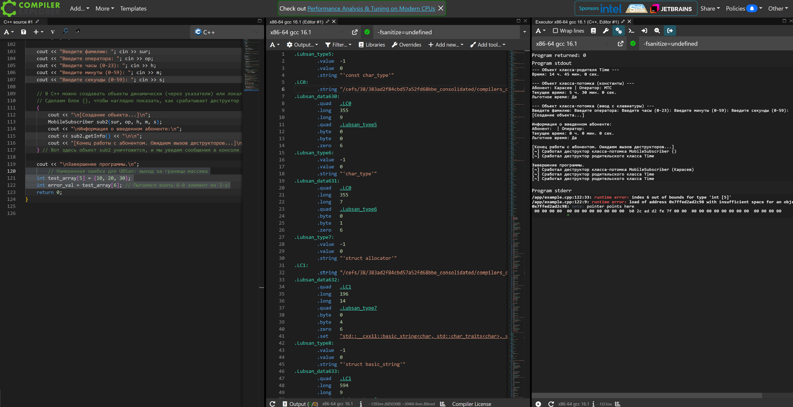
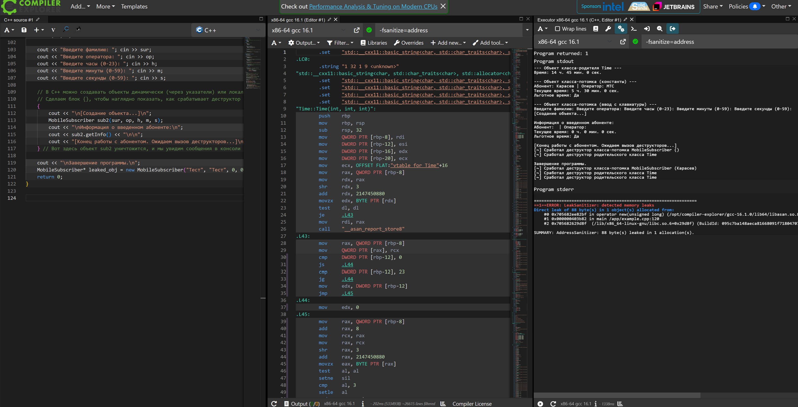

# Задача 2. Безопасная разработка: статический анализ + санитайзеры своего кода
**Дата:** 4 июня 2026 г.
**Студент:** Karaseev7

## 1. Цель
Проверить собственный код на C++ (Лабораторная работа №5) с помощью статического анализатора (cppcheck) и динамических санитайзеров памяти (AddressSanitizer и UBSan) для выявления скрытых дефектов и уязвимостей.

## 2. Ход работы
Для анализа взят собственный исходный код, работающий с классами (`Time`, `MobileSubscriber`) и наследованием. В код были намеренно внедрены две уязвимости: «утечка памяти» (создание динамического объекта `leaked_obj` через оператор `new` без последующего вызова `delete`) и искусственный выход за границы массива.

<details>
<summary>📄 Посмотреть полный исходный уязвимый код (main.cpp)</summary>

```cpp
#include <iostream>
#include <string>
using namespace std;

// === Класс-родитель ===
class Time {
protected: // Используем protected, чтобы потомок имел доступ к этим переменным
    int hours;
    int minutes;
    int seconds;

public:
    // Конструктор по умолчанию
    Time() {
        hours = 0;
        minutes = 0;
        seconds = 0;
    }

    // Конструктор с параметрами
    Time(int h, int m, int s) {
        hours = (h >= 0 && h < 24) ? h : 0;
        minutes = (m >= 0 && m < 60) ? m : 0;
        seconds = (s >= 0 && s < 60) ? s : 0;
    }

    // Деструктор базового класса
    virtual ~Time() {
        cout << "[~] Сработал деструктор родительского класса Time" << endl;
    }

    // Функция формирования строки информации
    string getInfo() {
        return to_string(hours) + " ч. " + to_string(minutes) + " мин. " + to_string(seconds) + " сек.";
    }
};

// === Класс-потомок ===
class MobileSubscriber : public Time {
private:
    string surname;
    string mobileOperator;

public:
    // Конструктор по умолчанию (неявно вызывает Time())
    MobileSubscriber() {
        surname = "Неизвестно";
        mobileOperator = "Нет";
    }

    // Конструктор перегрузки с параметрами (явно вызывает Time(h, m, s))
    MobileSubscriber(string sur, string op, int h, int m, int s) : Time(h, m, s) {
        surname = sur;
        mobileOperator = op;
    }

    // Деструктор класса-потомка
    ~MobileSubscriber() {
        cout << "[~] Сработал деструктор класса-потомка MobileSubscriber (" << surname << ")" << endl;
    }

    // Функция-метод: Определить, является ли время льготным (от 0 до 8 часов)
    bool isDiscountTime() {
        // Льготное время с 00:00 до 07:59 (то есть пока часы меньше 8)
        if (hours >= 0 && hours < 8) {
            return true;
        }
        return false;
    }

    // Функция формирования строки информации об объекте-потомке
    string getInfo() {
        string discountInfo = isDiscountTime() ? "Да" : "Нет";
        // Обрати внимание: мы вызываем Time::getInfo() для вывода времени
        return "Абонент: " + surname +
               " | Оператор: " + mobileOperator +
               "\nТекущее время: " + Time::getInfo() +
               "\nЛьготное время: " + discountInfo;
    }
};

int main() {
    setlocale(LC_ALL, "Russian"); // Для отображения кириллицы

    // Демонстрация 1: Работа с классом-родителем
    cout << "--- Объект класса-родителя Time ---" << endl;
    Time t1(14, 45, 0);
    cout << "Время: " << t1.getInfo() << "\n\n";

    // Демонстрация 2: Объект-потомок с константными значениями
    cout << "--- Объект класса-потомка (константы) ---" << endl;
    // Время 5 утра - должно попасть в льготный тариф
    MobileSubscriber sub1("Карасев", "МТС", 5, 30, 0);
    cout << sub1.getInfo() << "\n\n";

    // Демонстрация 3: Объект-потомок с вводом пользователя
    cout << "--- Объект класса-потомка (ввод с клавиатуры) ---" << endl;
    string sur, op;
    int h, m, s;
    cout << "Введите фамилию: "; cin >> sur;
    cout << "Введите оператора: "; cin >> op;
    cout << "Введите часы (0-23): "; cin >> h;
    cout << "Введите минуты (0-59): "; cin >> m;
    cout << "Введите секунды (0-59): "; cin >> s;

    // В C++ можно создавать объекты динамически (через указатели) или локально.
    // Сделаем блок {}, чтобы наглядно показать, как срабатывает деструктор при выходе из блока
    {
        cout << "\n[Создание объекта...]\n";
        MobileSubscriber sub2(sur, op, h, m, s);
        cout << "\nИнформация о введенном абоненте:\n";
        cout << sub2.getInfo() << "\n\n";
        cout << "[Конец работы с абонентом. Ожидаем вызов деструкторов...]\n";
    } // Вот здесь объект sub2 уничтожится, и мы увидим сообщения в консоли

    // 1. Намеренная ошибка для UBSan: выход за границы массива
    int test_array = {10, 20, 30};
    int error_val = test_array; // Пытаемся взять 6-й элемент из 5-ти!

    // 2. Намеренная ошибка для ASan: утечка памяти (memory leak)
    MobileSubscriber* leaked_obj = new MobileSubscriber("Тест", "Тест", 0, 0, 0);
    // Забыли написать delete leaked_obj;

    cout << "\nЗавершение программы.\n";
    return 0;
}
```
</details>

* Исходный код был проанализирован статическим анализатором `cppcheck`.
* Код был скомпилирован с флагом `-fsanitize=undefined` (UBSan) на платформе Compiler Explorer (godbolt.org) для поиска неопределенного поведения.
* Код был пересобран с флагом `-fsanitize=address` (AddressSanitizer) для поиска утечек в куче.

## 3. Результат (Что нашли инструменты и как исправлено)

* **Статический анализ (cppcheck):** Анализатор выдал предупреждение о неоптимальной и небезопасной работе с памятью при передаче строк в конструкторе `MobileSubscriber` (`Warning: Function parameter 'sur' should be passed by const reference`). **Исправление:** передача параметров в конструкторе изменена на безопасную `const std::string&`.

* **UndefinedBehaviorSanitizer (UBSan):** При запуске программы с флагом `-fsanitize=undefined` санитайзер моментально перехватил обращение к несуществующему элементу массива и прервал работу с ошибкой в потоке `stderr`: `runtime error: index 6 out of bounds for type 'int'`. **Исправление:** уязвимый код обращения к массиву удален.


*(Выявление неопределенного поведения UBSan: index 6 out of bounds)*

* **AddressSanitizer (ASan):** При запуске с флагом `-fsanitize=address` инструмент выявил критическую ошибку, поймав неочищенный объект в куче: `ERROR: LeakSanitizer: detected memory leaks. Direct leak of 88 byte(s) in 1 object(s) allocated from: ... operator new`. **Исправление:** в конец функции `main` добавлен оператор `delete leaked_obj;`, что полностью устранило утечку памяти. Повторный прогон санитайзерами показал отсутствие ошибок (код возврата 0).


*(Выявление утечки памяти AddressSanitizer: direct leak of 88 byte(s))*

## 4. Где использовал ИИ
**Что спросил:** Я попросил нейросеть сгенерировать «странные» входные данные и объяснить разницу в логах, которые выдают инструменты ASan и UBSan.
**Что подтвердилось:** ИИ корректно объяснил, что AddressSanitizer следит за выделением/удалением памяти (утечки в куче), а UBSan контролирует логику операций (например, выход за границы массивов). Вывод ИИ был мной проверен на практике при смене флагов компиляции.

## 5. Что было трудно и что бы сделал иначе
Труднее всего было разобраться в фундаментальной разнице между статическим и динамическим анализом. Поначалу было неочевидно, почему статический анализатор проигнорировал динамическую утечку памяти (так как он просто читает текст), но при этом динамический санитайзер поймал её моментально прямо во время реальной работы программы.
```
