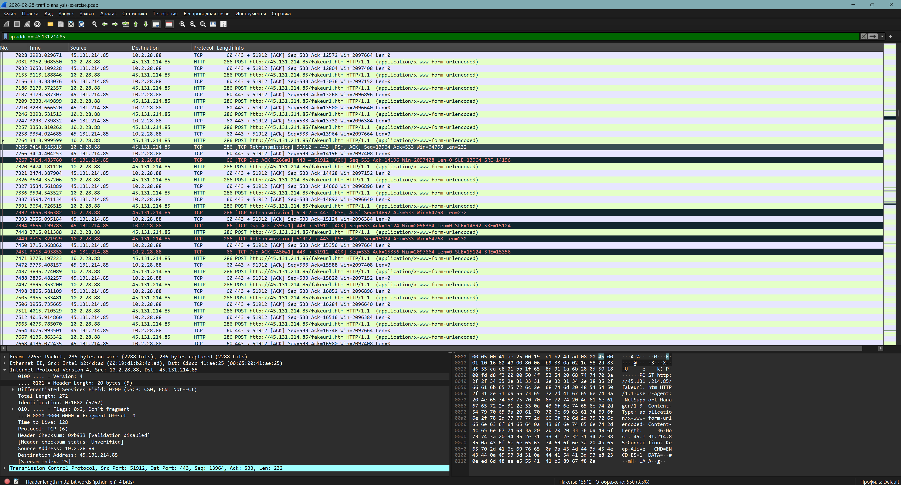
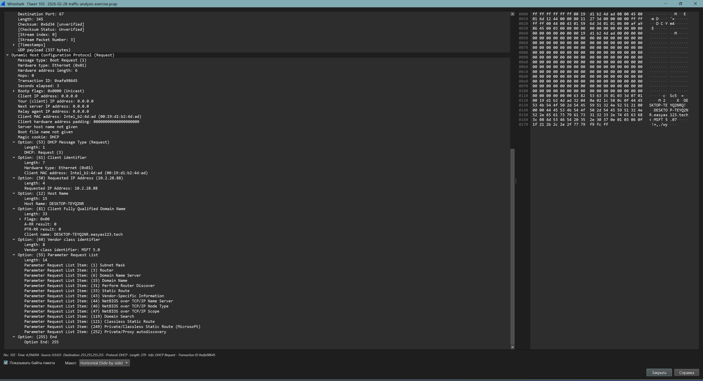

# Задача 11. Анализ сетевого трафика в Wireshark (Трек C)
**Дата:** 05.06.2026
**Студент:** Karaseev7

## 1. Цель
В рамках освоения базовых навыков SOC-аналитика первой линии мне нужно было проанализировать учебный `.pcap` дамп в Wireshark, найти подозрительную активность (в данном случае — следы работы RAT-трояна), собрать профиль зараженной машины и составить мини-инцидент-репорт.

## 2. Ход работы
В качестве исходных данных я взял свежий учебный дамп трафика от 28 февраля 2026 года с ресурса Malware-Traffic-Analysis. По легенде от SIEM-системы, в сети была зафиксирована активность, связанная с внешним IP-адресом `45.131.214.85` (RAT NetSupport Manager).

* **Шаг 1. Изоляция вредоносной сессии.** Я загрузил дамп в Wireshark и применил фильтр `ip.addr == 45.131.214.85`. В отфильтрованном списке я обнаружил, что с сервером злоумышленника активно общается внутренний хост с IP-адресом **10.2.28.88**.
* **Шаг 2. Анализ пакетов и поиск MAC-адреса.** При изучении TCP-сессии я увидел, что зараженный хост отправляет данные в открытом виде через HTTP POST-запросы к файлу `fakeurl.htm`. В содержимом пакета (Payload) я нашел заголовок `User-Agent: NetSupport Manager`. В этом же пакете, в разделе протокола *Ethernet II*, я вычислил физический адрес (MAC) отправителя: **00:19:d1:b2:4d:ad**.

*(Применение фильтра ip.addr, обнаружение вредоносных HTTP POST-запросов от хоста 10.2.28.88 и подтверждение User-Agent)*

* **Шаг 3. Идентификация имени хоста (Hostname).** Сначала я пытался искать через протокол `nbns`. Для более надежного результата я применил фильтр `dhcp`. В пакете *DHCP Request*, в разделе *Dynamic Host Configuration Protocol -> Options*, я развернул *Option: (12) Host Name* и *Option: (81)*, где и нашел точное имя устройства: **DESKTOP-TEYQ2NR** (и его полное доменное имя в сети `.easyas123.tech`).

*(Применение фильтра dhcp, развернутые опции 12 и 81 с именем компьютера DESKTOP-TEYQ2NR)*

## 3. Результат (Мини-инцидент-репорт)
В ходе анализа учебного сетевого трафика я подтвердил факт компрометации узла локальной сети трояном удаленного доступа (NetSupport Manager RAT). 
**Профиль скомпрометированной машины:**
* **IP-адрес:** 10.2.28.88
* **MAC-адрес:** 00:19:d1:b2:4d:ad
* **Имя хоста:** DESKTOP-TEYQ2NR (домен `easyas123.tech`)
Рекомендуется немедленная изоляция хоста 10.2.28.88 от корпоративной сети для проведения криминалистического анализа.

## 4. Где использовал ИИ
ИИ-ассистент помог мне разобраться с синтаксисом фильтров в Wireshark. Я просил его объяснить, в каких пакетах компьютеры передают свои имена. ИИ подсказал использовать протокол `dhcp` вместо `nbns` для более точного и надежного поиска имени компьютера, а также помог сориентироваться в структуре пакетов (например, подсказал, что MAC-адрес лежит в разделе *Ethernet II*). Саму интерпретацию вредоносного HTTP-трафика и поиск артефактов в дампе я провел самостоятельно.

## 5. Что было трудно и что бы сделал иначе
Самым трудным оказалось найти уникальное имя компьютера. Изначально я пытался искать его через фильтр NetBIOS (`nbns`), но в отфильтрованных пакетах видел в основном ответы от сервера и общее имя домена EASYAS123. Переход к анализу пакетов `dhcp` оказался гораздо эффективнее, так как при запросе IP-адреса компьютер отдает свое имя роутеру в открытом виде. В будущем для точной идентификации узлов в сети я буду в первую очередь проверять DHCP-трафик.
